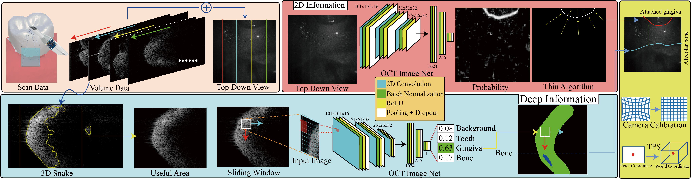

# Dentist Project
---
There is been writen in two lanuage of readme.
* [English version](#Outline_EN)
* [Chinese version](#大綱)

---
---
---

# Outline_EN
* [Introduction](#Introduction)
* [Code Introduction](#Code_Introduction)
* [Precondition](#Precondition)

## Introduction
Periodontal diagnosis requires discovery of the relations among teeth, gingiva (i.e., gums), and alveolar bones, but alveolar bones are inside gingiva and not visible for inspection. Traditional probe examination causes pains, and x-ray-based examination is not suited for frequent inspection. This work develops a non-invasive periodontal inspection framework based on gum-penetrative optical coherence tomography (OCT) which can be frequently applied without high radiation.

There is a system overview below:

Our goals is to get <b>Pocket depth</b>.

First, we use OCT to scan a volume data. By the data, we can convert input to two types of information. One is multi slices image data, another is a image data from the top down view.

Second, we take multi slices image data into 3D snake which includes neighbors information to get effective data. We implement a OCT Image Net to predict the location of tooth, gingiva, and alveolar bone, and use sliding windows method to generate more data improving the accuracy of the prediction on the nerual network. 

Third, we take image from top down view to get the boundary between tooth and meet, and use thin algorithm to get the minimize boundary.

Finally, we combine results from second part and third part, and use Camera Calibration and TPS to get the millimeters in world coordinate.

## Code_Introduction
There is several code in these github:
1.  DentistDemo:
This project is for demo. It will zip the scan results and send into DGX server. After the prediction is completed, grab the result to this code and display it.(It may take several minutes.)
2.  DentistProjectV2:
Main results is in this project.
3. DentistProjectV2_TensorflowNetProcess:
When DentistProjectV2 need neural network, it will use this process to call it.
4. DentistRawDataReader:
A Raw Data Reader. (Test only)
5. Paper TPS:
Do thin plate spline in python.
6. TensorflowNet:
All the things about OCT Network.
7.  Test_DentistDLL:
Communicate the OCT device though LabelView. (Test only) 
8. Test_Python:
Communicate C++ and python. (Test only)

## Precondition
* All branches needs:
Windows Install[連結](https://drive.google.com/drive/folders/16qELBn3ImgEa2IQq6oGBf-WMc3xXDUaw?usp=sharing)
Python3
Matlab 2018a (or newer version)[連結](https://www.mathworks.com/help/matlab/matlab_external/install-the-matlab-engine-for-python.html)

* Master Branch
1. OtherPackages [連結](https://drive.google.com/file/d/17b6n-TzxYkyxNUnvH5RrwMTeKcDy4P_k/view?usp=sharing)

* SURF_Test Branch
1. OtherPackages_with_xfeature2d [連結](https://drive.google.com/file/d/1pzJ0O5Nb8udP4ZHqwVP2HQob1S7FxNp1/view?usp=sharing)

# 大綱
* [介紹](#介紹)
* [軟體需求](#軟體需求)

## 介紹
---
以下為系統流程圖

而底下有幾個程式：
1.  DentistDemo:
此專案是 Demo用，將輸入的結果壓縮傳進 DGX Server 裡面
結果預測之後，跑出結果抓下來，顯示出來
2.  DentistProjectV2:
主要是所有功能都在裡面
3. DentistProjectV2_TensorflowNetProcess:
其中 DentistProjectV2 有使用到 Tensorflow Net
是由此小程式跑出來的結果
4. DentistRawDataReader
這裡主要是 RawData 的測試，在Project 一開始的時候用的，基本上後面的功能都在
DentistProjectV2 裡面都有
5. Paper TPS:
主要是做 TPS 的運算 (Python)，以及相關表格繪畫
6. TensorflowNet:
網路相關的 Net(Python)
7.  Test_DentistDLL:
此專案為測試醫院 OCT(LabelView) 溝通的 DLL 的專案
8. Test_Python:
此專案為為測試C++與 Python 溝通的測試專案與 class

## 軟體需求
---
* 共同需要安裝的檔案
Windows Install[連結](https://drive.google.com/drive/folders/16qELBn3ImgEa2IQq6oGBf-WMc3xXDUaw?usp=sharing)
Python3
Matlab 2018a以上，並執行[連結](https://www.mathworks.com/help/matlab/matlab_external/install-the-matlab-engine-for-python.html)

* Master Branch
1. OtherPackages [連結](https://drive.google.com/file/d/17b6n-TzxYkyxNUnvH5RrwMTeKcDy4P_k/view?usp=sharing)

* SURF_Test Branch
1. OtherPackages_with_xfeature2d [連結](https://drive.google.com/file/d/1pzJ0O5Nb8udP4ZHqwVP2HQob1S7FxNp1/view?usp=sharing)

